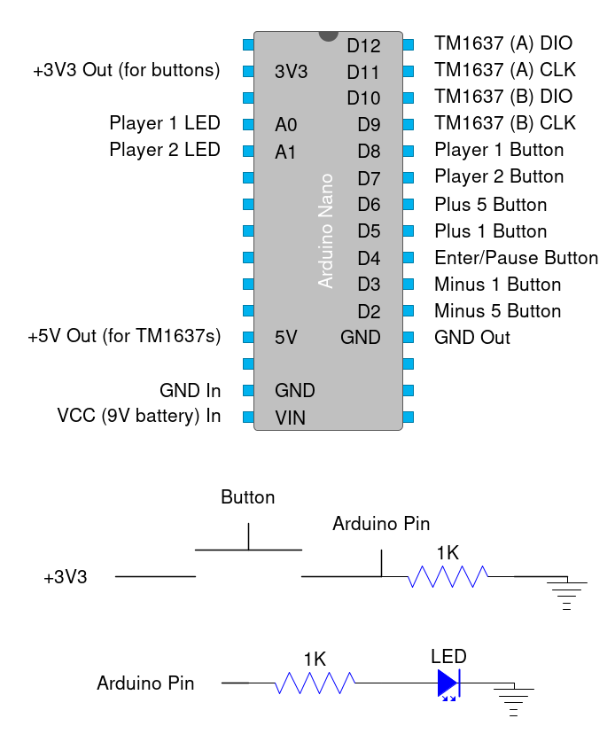

# Flagged
A simple chess clock driven by an Arduino Nano with TM1637 4-digit 7-segment displays.

Note: requires the Arduino library `Grove_4Digital_Display`.

## Organization
- `clock/` contains the Arduino code
- `diylc/` contains the DIY Layout Creator files (schematic & stripboard)
- `images/` contains all images for the README
- `prints/` contains the STL files for the case

## Bill of Materials
- 1x Arduino Nano
- 2x TM1637 4-digit displays
- 1x 9V battery connector
- 2x LEDs
- 9x 1K resistors
- 7x momentary push buttons
- 1x SPST switch (optional - on/off switch)

## Schematic & Stripboard

## Case Design

